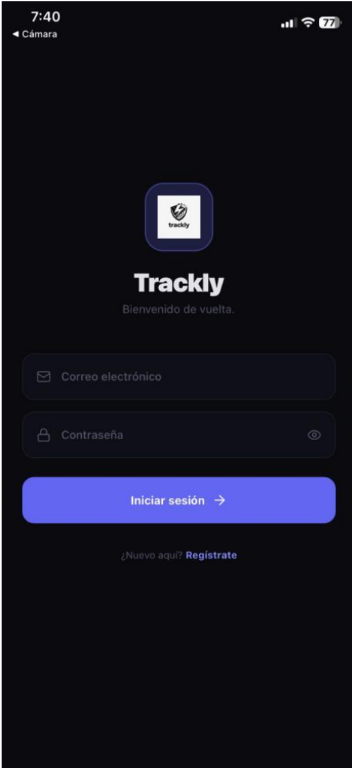
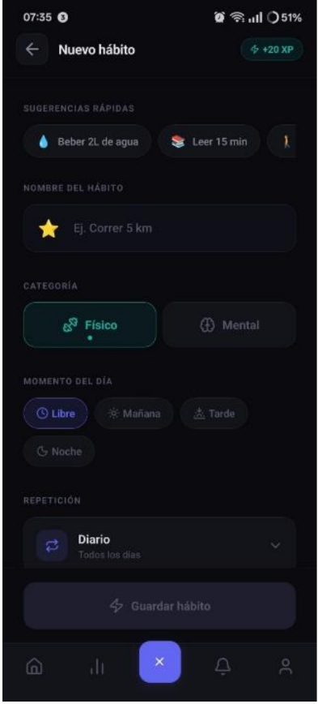
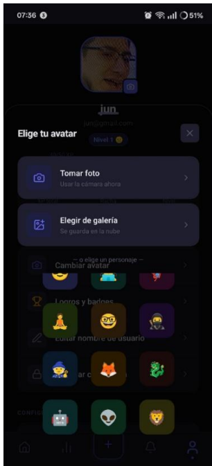

# 🎯 Trackly — Gestor de Hábitos

Aplicación móvil desarrollada en React Native con Expo que te ayuda a construir y mantener hábitos de forma constante, con un sistema de progresión por niveles y logros que hace el proceso más motivador.

📲 **Descarga directa (Android):** [Expo Build](https://expo.dev/accounts/adanl004/projects/trackly/builds/0e2d3980-0ab5-4821-a254-359fe696bcb0)

---

## ✨ Funcionalidades

- **Registro e inicio de sesión** con correo y contraseña
- **Creación de hábitos personalizados** con nombre, categoría (Físico / Mental), momento del día (Libre, Mañana, Tarde, Noche) y frecuencia de repetición
- **Sugerencias rápidas** de hábitos comunes para empezar fácilmente
- **Sistema de XP y niveles** — ganas experiencia cada vez que completas un hábito
- **Logros y badges** — recompensas por racha y consistencia
- **Perfil con avatar** — elige entre personajes o usa tu propia foto
- **Notificaciones** — recordatorios según el momento del día configurado

---

## 📸 Capturas de pantalla

| Login | Nuevo hábito | Perfil |
|-------|-------------|--------|
|  |  |  |

---

## 🛠️ Tecnologías utilizadas

- **React Native** — Desarrollo móvil multiplataforma
- **Expo / EAS** — Build y distribución de la app
- **Node.js** — Backend y API REST
- **JavaScript** — Lenguaje principal

---

## 🚀 Cómo ejecutar en local

1. Clona el repositorio
   ```bash
   git clone https://github.com/ClothingNut7/PowHa.git
   cd PowHa
   ```

2. Instala dependencias
   ```bash
   npm install
   ```

3. Inicia la app
   ```bash
   npx expo start
   ```

4. Escanea el código QR con la app **Expo Go** en tu dispositivo

---

## 👨‍💻 Autor

**Adán Leonardo Granados Martínez**  
Estudiante de Ingeniería en Tecnologías de la Información e Innovación Digital  
[LinkedIn](https://www.linkedin.com/in/adán-leonardo-granados-martínez-6b1589251)
